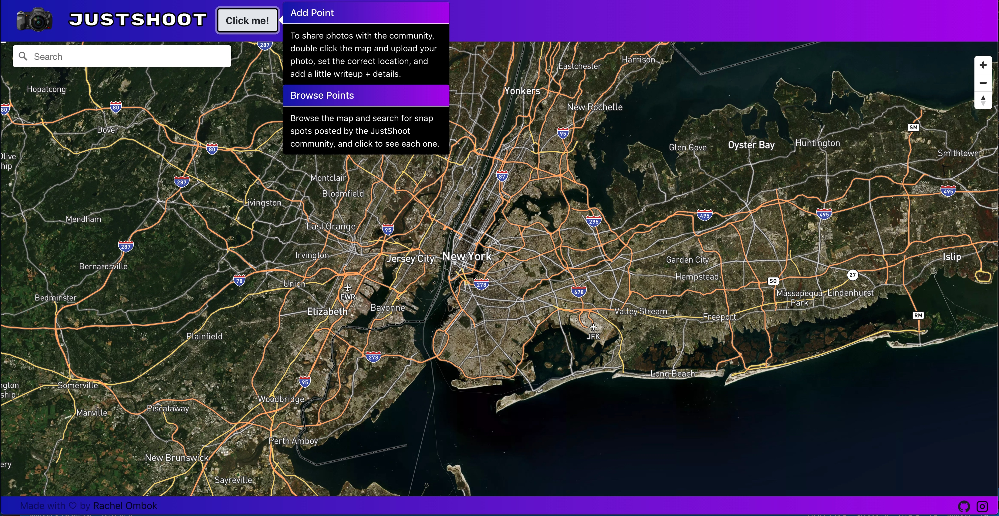
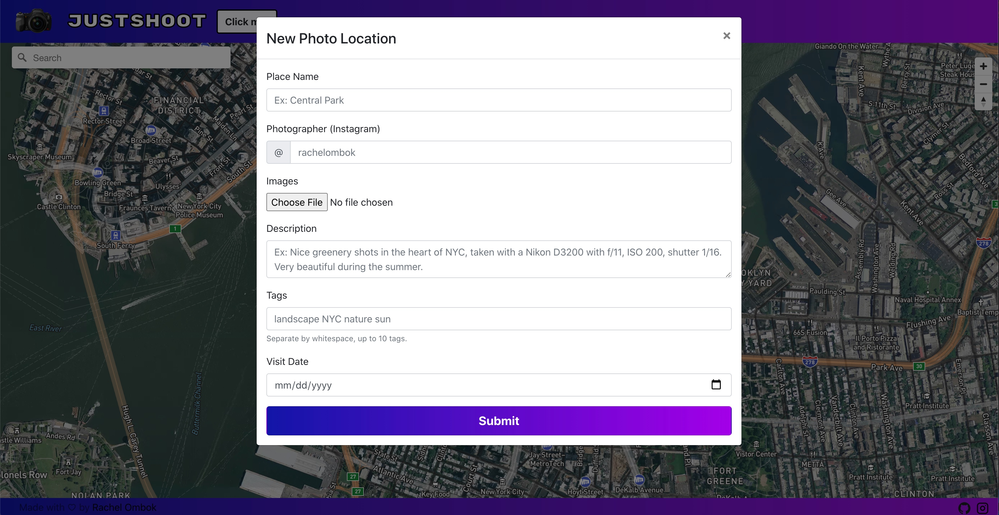

# JustShoot , aka photologgapp

photolog app, justshoot.netlify.app
[View the app here](https://justshoot.netlify.app)

This is a photo log entry app made with React, NodeJS, react-map-gl, mongoose, multer-s3, react-bootstrap, MUI, react-toastify, and a bunch of other packages. Client on Netlify, Server on Heroku. [Video demo](https://www.youtube.com/watch?v=Zye6HkykpDY)

to push to server:
`git subtree push --prefix server heroku master`

to push client
`git push origin master`

to start server:
`cd server, npm run dev`

to start client:
`cd client, npm start`

to lint client:
`npx eslint`

to lint server:
`npm run lint`
